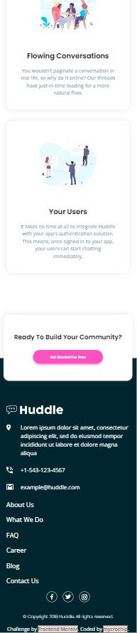
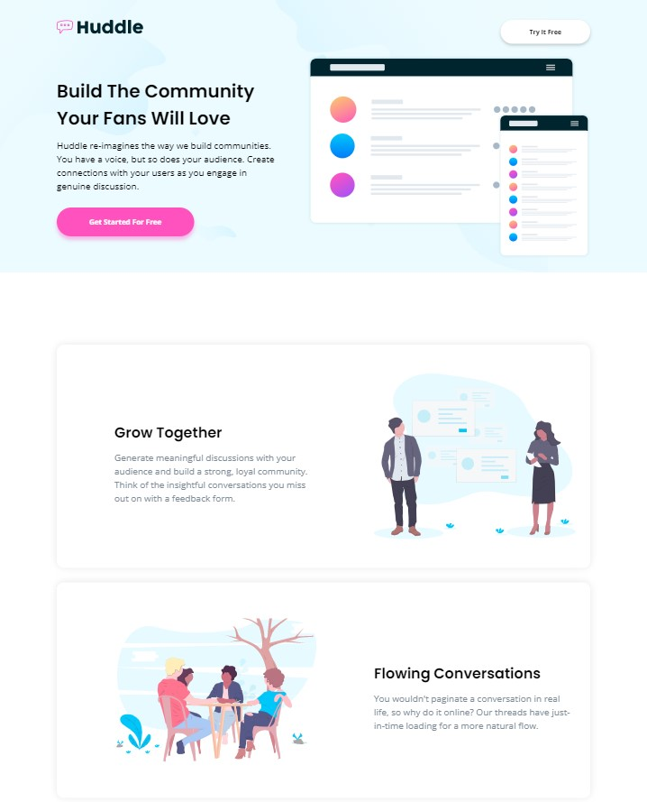
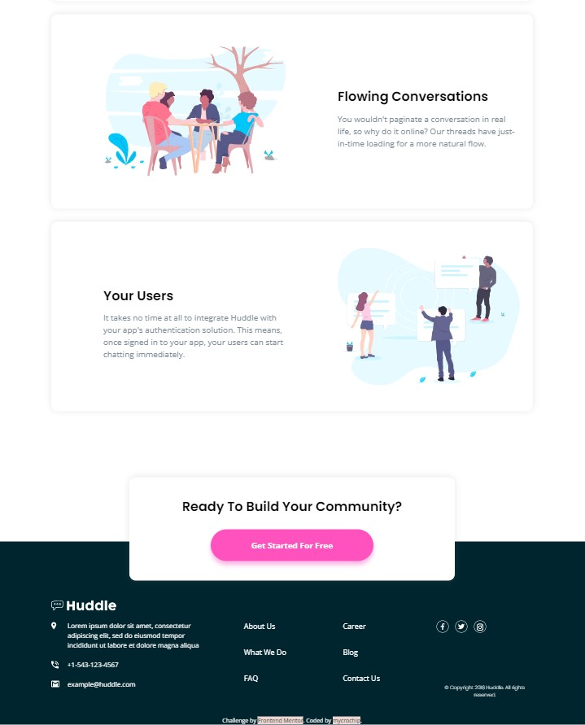

# Frontend Mentor - Huddle landing page with alternating feature blocks solution

This is a solution to the [Huddle landing page with alternating feature blocks challenge on Frontend Mentor](https://www.frontendmentor.io/challenges/huddle-landing-page-with-alternating-feature-blocks-5ca5f5981e82137ec91a5100). Frontend Mentor challenges help you improve your coding skills by building realistic projects. 

## Table of contents

- [Overview](#overview)
  - [The challenge](#the-challenge)
  - [Screenshot](#screenshot)
  - [Links](#links)
- [My process](#my-process)
  - [Built with](#built-with)
  - [What I learned](#what-i-learned)
  - [Continued development](#continued-development)
- [Author](#author)

## Overview

### The challenge

Users should be able to:

- View the optimal layout for the site depending on their device's screen size
- See hover states for all interactive elements on the page

### Screenshot

#### Moble View - 375px
 

#### Desktop View - 1440px
 

### Links

- Solution URL: [GitHub](https://github.com/mycrochip/huddle-landing-page-with-alternating-feature-blocks.git)

- Live Site URL: [GitHub Pages](https://mycrochip.github.io/huddle-landing-page-with-alternating-feature-blocks/)

## My process

### Built with

- Semantic HTML5 markup
- CSS custom properties
- Flexbox
- CSS Grid
- Mobile-first workflow

### What I learned

As expected, I learned a lot from completing this project on Frontend Mentor. I added another word to my vocabulary of "don'ts" - setting elements to be 100vw (full viewport widths). Doing this makes a persisting horizontal scroll bar appear at the bottom of your page and could lead to debugging problems. In my case, I tweaked and tweaked till I 'control zeed' to oblivion. 

The problem with using 100vw is that a portion of your viewport has been set aside for your compulsory side scroll bar when content gets reasonably longer downwards. Now, you're ignoring the scrollbar and letting your element span the full device width. The horizontal scroll bar exists to help you scroll to the content behind the vertical scroll bar because this scroll bar will always be above your content. To avoid this headache, just set all widths to 100% when you need them. They will take 100% of the space allocated to them (this excludes the pixels reserved for scrollbars)

### Continued development

More projects to be completed on [FrotendEnd Mentor](https://www.frontendmentor.io/)

## Author

- Frontend Mentor - [@mycrochip](https://www.frontendmentor.io/profile/mycrochip)
- Twitter - [@mycrochip_world](https://www.twitter.com/mycrochip_world)